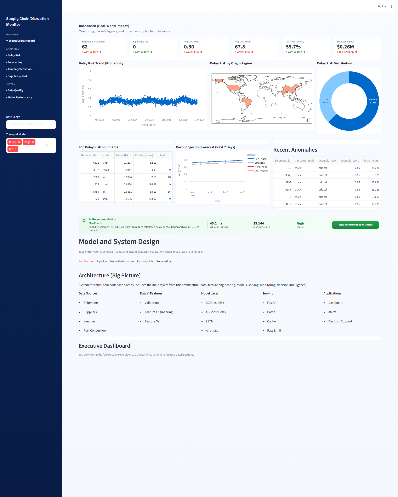
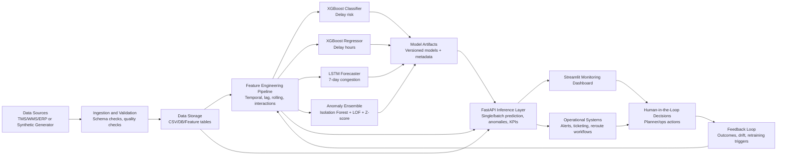

# Agentic-SupplyChain-Decision-System: Predictive Monitoring for Supply Chain Disruptions

Research-grade end-to-end agentic decision and predictive monitoring system for proactive supply chain risk intelligence, including:
- Synthetic data generation with realistic statistical dependencies
- Delay-risk prediction (classification + regression)
- Temporal forecasting (LSTM)
- Anomaly detection and operational alerts
- FastAPI inference service
- Streamlit monitoring dashboard

## 1. Why This Project

Global supply chains are exposed to stochastic disruptions from weather, port congestion, supplier instability, and transport variability. Traditional reactive workflows detect disruption too late.

This project implements a predictive monitoring framework to:
- Anticipate shipment delays before SLA violations
- Quantify disruption risk with interpretable features
- Detect anomalous behavior in near real time
- Support proactive intervention (rerouting, supplier fallback, expedite mode)

## 2. Project Objectives

1. Build realistic synthetic data representing multi-factor supply chain behavior.
2. Train robust ML models for delay probability and delay-hours estimation.
3. Forecast temporal congestion dynamics via sequence modeling.
4. Detect anomalies for operational early warning.
5. Expose predictions and decision support signals through API and dashboard for practical MLOps integration.

## 3. Scope

### In Scope
- Data generation for:
  - `shipments.csv`
  - `suppliers.csv`
  - `weather.csv`
  - `port_congestion.csv`
  - `disruptions.csv`
  - `features.csv`
- Feature engineering pipeline with lag/rolling/interaction features
- XGBoost and LSTM model training
- Model evaluation and diagnostics
- Anomaly detection pipeline
- FastAPI serving and Streamlit dashboard

### Out of Scope (current version)
- Live ERP/TMS/WMS integration
- Online model retraining
- Production authentication/authorization hardening
- Cloud deployment IaC

## 4. Repository Structure

```text
Agentic-SupplyChain-Decision-System/
├── data/
│   ├── generate_data.py
│   ├── shipments.csv
│   ├── suppliers.csv
│   ├── weather.csv
│   ├── port_congestion.csv
│   ├── disruptions.csv
│   └── features.csv
│
├── notebooks/
│   ├── 01_eda.ipynb
│   ├── 02_feature_engineering.ipynb
│   └── 03_modeling.ipynb
│
├── src/
│   ├── data/
│   │   └── loader.py
│   ├── features/
│   │   └── build_features.py
│   ├── models/
│   │   ├── train_xgboost.py
│   │   ├── train_lstm.py
│   │   └── evaluate.py
│   ├── anomaly/
│   │   └── anomaly_detection.py
│   └── api/
│       └── app.py
│
├── dashboard/
│   └── streamlit_app.py
├── configs/
│   └── config.yaml
├── tests/
├── requirements.txt
├── README.md
└── AGENT.md
```

## 18. Implemented Improvement Baseline

The following items from the improvement roadmap are now implemented in code:

1. Reliability and Data Quality
- Pandera data contracts and quality gate in `src/data/contracts.py`.
- Training now blocks on failed quality checks (`fail_on_error` in `configs/config.yaml`).
- Automated data quality report output to `reports/data_quality_report.json`.

2. MLOps and Reproducibility
- Optional MLflow tracking in `src/mlops/tracking.py` for XGBoost and LSTM runs.
- Dataset lineage manifest saved to `models/lineage_manifest.json`.
- Docker packaging via `Dockerfile` and `docker-compose.yml`.

3. Model Quality and Safety
- Classifier calibration support (sigmoid) saved as `models/xgb_classifier_calibrator.joblib`.
- Slice metrics by mode/weather/supplier bucket saved to `models/slice_metrics.json`.
- Champion-challenger promotion gate saved to `models/promotion_decision.json` and `models/champion_metrics.json`.

4. Serving and Performance
- FastAPI auth toggle + API key validation.
- Request rate limiting and audit middleware.
- Prediction response caching and async batch job endpoints:
  - `POST /predict/batch/async`
  - `GET /predict/batch/async/{job_id}`

5. Monitoring and Continuous Learning
- Drift and prediction-quality monitoring pipeline in `src/monitoring/run_monitoring.py`.
- Monitoring report output to `reports/monitoring_report.json`.
- Scheduled retraining + approval gate script in `src/mlops/retrain.py`.

6. Decision Intelligence
- Action recommendation and cost-impact estimation in `src/decision/intelligence.py`.
- API prediction now includes action, expected delay reduction, and estimated cost avoided.

## 19. New Operational Commands

```bash
# Train with quality gates + lineage + champion-challenger + calibration
python -m src.models.train_xgboost

# Train LSTM with quality gate + optional MLflow logging
python -m src.models.train_lstm

# Run drift and production quality monitoring
python -m src.monitoring.run_monitoring

# Run scheduled retraining workflow with approval/rollback markers
python -m src.mlops.retrain

# Run services in containers
docker compose up --build

# Install Playwright browser (first time only)
python -m playwright install chromium

# Export dashboard images (requires Streamlit app running)
python scripts/export_dashboard_images.py
```

Dashboard image outputs:
- `reports/figures/dashboard-full.png`
- `reports/figures/dashboard-overview.png`
- `reports/figures/dashboard-kpis.png`

Model/design tab image inputs (optional):
- `dashboard/assets/architecture.png`
- `dashboard/assets/pipeline.png`
- `dashboard/assets/model_performance.png`
- `dashboard/assets/explainability.png`
- `dashboard/assets/forecasting.png`

## 5. Data Design and Synthetic Generation Logic

Synthetic generation follows explicit stochastic assumptions with causal structure:

1. Supplier layer:
- Reliability: Beta-distributed (right-skewed)
- Failure rate anti-correlated with reliability
- Lead times from Gamma distribution

2. Environmental layer:
- Seasonal weather with AR(1) temporal noise
- Location-specific severity progression

3. Port layer:
- Congestion via Ornstein-Uhlenbeck mean-reverting process
- Weekly stress effects (Mon/Fri)

4. Shipment delay model:
- Logistic probability from weather, congestion, supplier risk, traffic, distance, mode
- Delay hours from log-normal conditional distribution

5. Disruptions:
- Event process intensity increases with delay severity
- Event type weighted by underlying causal factors

## 6. Modeling Architecture

### 6.1 Delay Classification
- Algorithm: XGBoostClassifier
- Target: `delayed` (0/1)
- Metrics: ROC-AUC, Average Precision, F1-Macro
- Imbalance handling: dynamic `scale_pos_weight`

### 6.2 Delay-Hours Regression
- Algorithm: XGBoostRegressor
- Target: `delay_hours`
- Trained on delayed shipments only
- Log-transform target for variance stabilization
- Metrics: RMSE, MAE, R²

### 6.3 Sequence Forecasting
- Algorithm: PyTorch LSTM
- Input window: 30 days
- Horizon: 7 days
- Features: congestion, queue time, weather severity
- Metrics: step-wise MAE/RMSE

### 6.4 Anomaly Detection
- Isolation Forest + LOF + Z-score ensemble
- Risk thresholds mapped to `normal/elevated/high/critical`
- Rule-boosted scoring for operational edge cases

## 7. Feature Engineering Highlights

- Temporal features: day/week/month/quarter, cyclical sin/cos
- Rolling stats: 7/14/30-day congestion mean/std
- Lag features: congestion t-1, t-7, t-14
- Interaction terms:
  - weather × congestion
  - weather × supplier risk
  - congestion × traffic
- Composite risk score in [0, 1]

## 8. API Endpoints

Service: `src/api/app.py`

- `GET /` service metadata
- `GET /health` model readiness
- `POST /predict/delay` single shipment prediction
- `POST /predict/batch` batch prediction (max 500)
- `GET /anomalies` top anomalous shipments
- `GET /congestion` current port alerts
- `GET /metrics` operational KPIs

## 9. Dashboard Capabilities

App: `dashboard/streamlit_app.py`

- KPI overview (delay rate, avg delay, risk)
- Weekly trend analysis
- Risk map and hotspot visualizations
- Anomaly table and severity distribution
- Port congestion monitoring
- Interactive what-if predictor

### Dashboard Preview

The dashboard screenshot is stored at `reports/figures/dashboard-overview.png` and rendered below.



## 10. Installation

### Prerequisites
- Python 3.10+
- Windows/macOS/Linux

### Setup

```bash
# from project root
python -m venv .venv
# Windows PowerShell
.\.venv\Scripts\Activate.ps1

pip install --upgrade pip
pip install -r requirements.txt
```

## 11. How to Run (End-to-End)

### Step 1: Generate synthetic datasets

```bash
python data/generate_data.py
```

Expected outputs in `data/`:
- `suppliers.csv`
- `weather.csv`
- `port_congestion.csv`
- `shipments.csv`
- `disruptions.csv`
- `features.csv`

### Step 2: Train XGBoost models

```bash
python -m src.models.train_xgboost
```

### Step 3: Train LSTM forecaster

```bash
python -m src.models.train_lstm
```

### Step 4: Evaluate all models

```bash
python -m src.models.evaluate
```

Evaluation outputs:
- `reports/figures/*.png`
- `reports/evaluation_summary.json`

### Step 5: Run API server

```bash
uvicorn src.api.app:app --host 0.0.0.0 --port 8000
```

Open docs at:
- `http://127.0.0.1:8000/docs`

### Step 6: Run dashboard

```bash
streamlit run dashboard/streamlit_app.py
```

## 12. Testing

Run smoke/unit tests:

```bash
pytest -q
```

## 13. Reproducibility and Research Notes

- Fixed random seeds across generation and training scripts
- Time-aware splitting prevents leakage from future data
- Config-driven experiment setup in `configs/config.yaml`
- Dataset relationships enforce realistic relational joins
- Delay labels are causally linked to exogenous and endogenous features

## 14. Suggested Production Roadmap

1. Replace synthetic generator with real ETL from TMS/WMS/ERP.
2. Add MLflow experiment tracking and model registry.
3. Add drift detection and scheduled retraining.
4. Deploy with Docker + CI/CD + observability stack.
5. Add RBAC and API authentication.

## 15. Citation / Acknowledgment

If you use this project for research or prototyping, cite as:

> Agentic-SupplyChain-Decision-System: Predictive Monitoring for Supply Chain Disruptions (2026), synthetic benchmark implementation with XGBoost, LSTM, and anomaly detection.

## 16. Next Steps (System Development)

This roadmap focuses on developing the system from prototype to production-ready platform.

1. Phase 1: Data Foundation
- Integrate real data sources from TMS/WMS/ERP into a unified ingestion layer.
- Define data contracts and schema versioning for all core entities.
- Add automated data quality checks (freshness, completeness, integrity, drift).
- Deliverable: production ETL/ELT pipeline with monitored daily refresh.

2. Phase 2: Feature Store and Training Orchestration
- Convert feature engineering into scheduled, reproducible jobs.
- Persist curated features in a feature store (offline and online variants).
- Implement experiment tracking and model registry for all training runs.
- Deliverable: reproducible training pipeline with lineage and model governance.

3. Phase 3: Model Reliability and Risk Controls
- Add threshold optimization and business-cost-aware objective tuning.
- Implement probabilistic calibration and confidence intervals for predictions.
- Add route/supplier-level bias and stability checks before deployment.
- Deliverable: validated model package with acceptance criteria and rollback plan.

4. Phase 4: Serving Architecture and Integration
- Harden the API with authentication, authorization, rate limiting, and audit logs.
- Introduce asynchronous inference for batch scoring and event-driven updates.
- Integrate outputs into planning workflows (alerts, ticketing, reroute triggers).
- Deliverable: secure, scalable inference service integrated with operations.

5. Phase 5: Monitoring, Observability, and MLOps
- Add dashboards for model performance, drift, and SLA adherence.
- Implement canary deployment, shadow testing, and automated rollback.
- Schedule retraining with guardrails and post-deployment evaluation checks.
- Deliverable: closed-loop MLOps lifecycle with continuous monitoring.

6. Phase 6: Decision Intelligence and Optimization
- Extend from prediction to prescriptive actions (rerouting, expedite mode, supplier fallback).
- Add scenario simulation for disruption stress testing and what-if analysis.
- Quantify business impact (cost avoided, SLA uplift, recovery time reduction).
- Deliverable: decision-support layer tied to measurable operational KPIs.

## 17. High-Level Architecture Diagram



